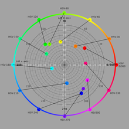
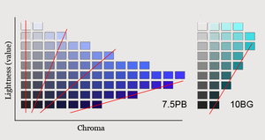

<a name="table-of-contents"/>

# Colors

##### Table of Contents
- Fundamentals
  - [Hue](#hue)
  - [Saturation](#saturation)
  - [Lightness](#lightness)
- [Color Systems](#systems)
- [Psychology](#psychology)

# The Fundmantals of Color

<a name="hue"/>

### Hue

In color theory, hue is one of the main properties (called color appearance parameters) of a color, defined technically in the CIECAM02 model as "the degree to which a stimulus can be described as similar to or different from stimuli that are described as red, orange, yellow, green, blue, purple,"[1] which in certain theories of color vision are called unique hues.

Hue can typically be represented quantitatively by a single number, often corresponding to an angular position around a central or neutral point or axis on a color space coordinate diagram (such as a chromaticity diagram) or color wheel, or by its dominant wavelength or that of its complementary color. The other color appearance parameters are colorfulness, saturation (also known as intensity or chroma),[2] lightness, and brightness. Usually, colors with the same hue are distinguished with adjectives referring to their lightness or colorfulness, such as with "light blue", "pastel blue", "vivid blue", "cobalt blue". Exceptions include brown, which is a dark orange.[3]

In painting, a hue is a pure pigment—one without tint or shade (added white or black pigment, respectively).[4]

Hues are first processed in the brain in areas in the extended V4 called globs.[5][6]

Although the variance in luminance is easy to notice for HSL/HSV, the variation in hue is less perceivable. This graph maps 12 points on the HSV color wheel to CIELAB's color plane, displaying the lack of uniformity in hue and saturation.

###### Dominant Wavelength

Dominant wavelength (or sometimes equivalent wavelength) is a physical analog to the perceptual attribute hue. On a chromaticity diagram, a line is drawn from a white point through the coordinates of the color in question, until it intersects the spectral locus. The wavelength at which the line intersects the spectrum locus is identified as the color's dominant wavelength if the point is on the same side of the white point as the spectral locus, and as the color's complementary wavelength if the point is on the opposite side

<a name="saturation"/>

### Saturation [1](https://en.wikipedia.org/wiki/Colorfulness)

Colorfulness, chroma and saturation are attributes of perceived color relating to chromatic intensity. As defined formally by the International Commission on Illumination (CIE) they respectively describe three different aspects of chromatic intensity, but the terms are often used loosely and interchangeably in contexts where these aspects are not clearly distinguished. The precise meanings of the terms vary by what other functions they are dependent on.

Colorfulness is the "attribute of a visual perception according to which the perceived color of an area appears to be more or less chromatic[clarification needed]".[1][2] The colorfulness evoked by an object depends not only on its spectral reflectance but also on the strength of the illumination, and increases with the latter unless the brightness is very high (Hunt effect).
Chroma is the "colorfulness of an area judged as a proportion of the brightness of a similarly illuminated area that appears white or highly transmitting".[3][2] As a result, chroma is mostly only dependent on the spectral properties, and as such is seen to describe the object color.[4] It is how different from a grey of the same lightness such an object color appears to be.[5]
Saturation is the "colorfulness of an area judged in proportion to its brightness",[6][2] which in effect is the perceived freedom from whitishness of the light coming from the area. An object with a given spectral reflectance exhibits approximately constant saturation for all levels of illumination, unless the brightness is very high.[7]
As colorfulness, chroma, and saturation are defined as attributes of perception, they can not be physically measured as such, but they can be quantified in relation to psychometric scales intended to be perceptually even—for example, the chroma scales of the Munsell system. While the chroma and lightness of an object are its colorfulness and brightness judged in proportion to the same thing ("the brightness of a similarly illuminated area that appears white or highly transmitting"), the saturation of the light coming from that object is in effect the chroma of the object judged in proportion to its lightness. On a Munsell hue page, lines of uniform saturation thus tend to radiate from near the black point, while lines of uniform chroma are vertical.[7]

<a name="lightness"/>

### Lightness [1](https://en.wikipedia.org/wiki/Lightness)

In colorimetry and color theory, lightness, also known as value or tone, is a representation of a color's brightness. It is one of the color appearance parameters of any color appearance model.

Various color models have an explicit term for this property. The Munsell and HSV color models use the term value, while the HSL color model, HCL color space and CIELAB color space use the term lightness.

In some of these models (Munsell, HCL and CIELAB), the lightness or value is the absolute brightness. In Munsell, for example, the only color with value 0 is pure black, and the only color with value 10 is pure white. Colors with a discernable hue must have values in between these extremes.

In HSL and HSV, the lightness or value is a relative brightness. Both systems use coordinate triples, where many triples can map onto the same color. In HSV, all triples with value 0 are pure black. If the hue and saturation are held constant, then increasing the value increases the brightness, such that a value of 1 is the brightest color with the given hue and saturation. HSL is similar, except that all triples with lightness 1 are pure white. In both models, all pure saturated colors have the same lightness or value, and the absolute brightness is determined by the hue: yellow is brighter than blue.

In subtractive color (e.g., paints) value changes through various tints and shades can be achieved by adding white or black, respectively, to the color. However, this also reduces saturation. Chiaroscuro and Tenebrism both take advantage of dramatic contrasts of value to heighten drama in art. Artists may also employ shading, subtle manipulation of value.

<a name="psychology"/>

# The Pyschology of Color

### Perception

### Mental Effects

<a name="systems"/>

# Color Systems

#### RGB

#### RGB

#### RGB

#### RGB

#### RGB

#### RGB
