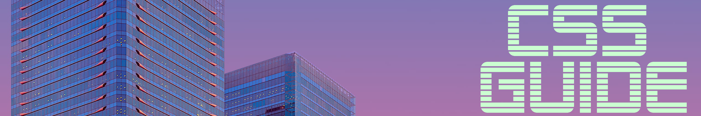
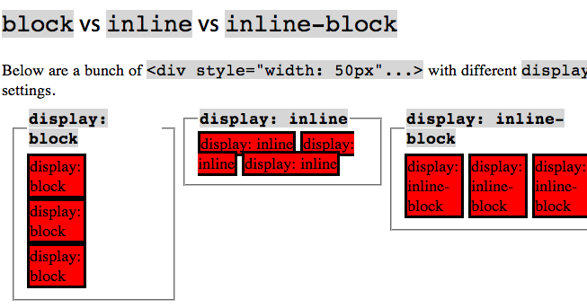
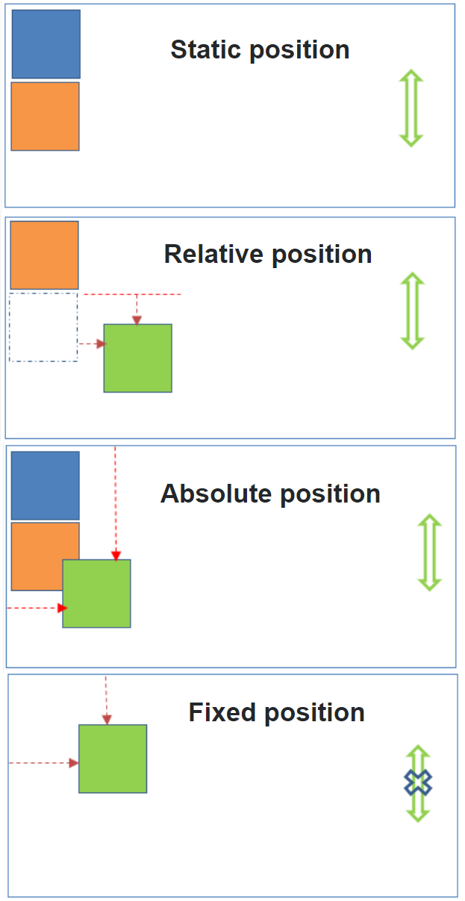

<a name="table-of-contents"/>



---------------------

##### Table of Contents

- [Flex](#flex)
  - [Definitive Guide](https://css-tricks.com/snippets/css/a-guide-to-flexbox/)
- [Grid](#grid)
- [Icons](#icons)
- [Fonts](#fonts)
- [Variables](#variables)
- [Keywords](#keywords)
- [Root and Global Variables](#root)
- [Psuedo Elements](#psuedo)
  - [before / after](#before-after)
- [Display](#display)
- [Position](#position)
- [Useful External Tools](#external-tools)
  - [visualizers](#visualizers)
  - [plugins](#plugins)
- [Preprocessing](#preprocessing)
- [Assets](#assets)
  - [Favorite Re-usable Components/Pens](#favorites)
- [Components](#components)
  - [Tooltip](#tooltip)
  - [Comment Box](#comment-box)
- [Colors](https://github.com/trevor-reznik/guides/tree/master/colors)
  - [HSL](#hsl)
- [Design Philosophies](#design-philosophies)
  - [material](#material)


-----------------------------------------------------------------


# Pending Content - Temporary

**Run table of contents script on this guide**

 - [css at rules](https://developer.mozilla.org/en-US/docs/Web/CSS/At-rule)
 - http://www.paulgraham.com/road.html
 - https://developer.mozilla.org/en-US/docs/Learn/Getting_started_with_the_web/How_the_Web_works
 - https://eater.net/inet
 - https://learnlayout.com/
 - https://www.xul.fr/javascript/get-post.php
 - firefox debugger advantages
 - opening page in all browsers simulatensouly with local server host


<a name="design-philosophies"/>

# Design Systems


<a name="material"/>

### Material

###### Scalable Variable System

```css
* {
  background: linear-gradient(
      rgba(255, 255, 255, var(--overlay)),
      rgba(255, 255, 255, var(--overlay))
    ),
    linear-gradient(#121212, #121212);
  box-shadow: var(--elevation) calc(var(--elevation) * 1.6) 3px
      rgba(12, 12, 12, 0.06),
    calc(var(--elevation) * 0.2) calc(var(--elevation) * 0.32) 0.5px
      rgba(12, 12, 12, 0.18);
  border-radius: 4px;
  margin: 0;
  padding: 0;
  -webkit-box-sizing: border-box;
  -mos-box-sizing: border-box;
  font-family: Roboto, Noto Sans, monospace, sans serif;
}

/*  ELEVATIONS ∷ 0dp:0-1% ∷ 1dp:5% ∷ 2dp:7% ∷ 3dp:8% ∷ 4dp:9% ∷ 6dp:11% ∷ 8dp:12% ∷ 12dp:14% ∷ 16dp:15% ∷ 24dp:16%
*/

body, html {
  --overlay: 0.01;
  --elevation: 0;
}

/* COMPNONENTS ∷ Card: 1dp to 8dp ∷ App bar: 4dp ∷ FAB: 6dp, 2dp to 8dp ∷ Nav drawer: 16dp ∷ Dialog: 24dp
 */

body > div {
  --overlay: 0.02;
  --elevation: 1;
}
```


<a name="hsl"/>

# HSL


<a name="psuedo"/>

# Psuedo Elements


<a name="before-after"/>

### Before / After

`::before`

`::after`

In CSS, ::before creates a pseudo-element that is the first child of the selected element. It is often used to add cosmetic content to an element with the content property. It is inline by default.

```css
/* Add a heart before links */
a::before {
  content: "♥";
}
```

```css
.ribbon {
  background-color: #5BC8F7;
}

.ribbon::before {
  content: "Look at this orange box.";
  background-color: #FFBA10;
  border-color: black;
  border-style: dotted;
}
```

###### Toggling

```css
li {
  list-style-type: none;
  position: relative;
  margin: 2px;
  padding: 0.5em 0.5em 0.5em 2em;
  background: lightgrey;
  font-family: sans-serif;
}

li.done {
  background: #CCFF99;
}

li.done::before {
  content: '';
  position: absolute;
  border-color: #009933;
  border-style: solid;
  border-width: 0 0.3em 0.25em 0;
  height: 1em;
  top: 1.3em;
  left: 0.6em;
  margin-top: -1em;
  transform: rotate(45deg);
  width: 0.5em;
}
```

```javascript
var list = document.querySelector('ul');
list.addEventListener('click', function(ev) {
  if (ev.target.tagName === 'LI') {
     ev.target.classList.toggle('done');
  }
}, false);

// Here is the above code example running live. Note that there are no icons used, and the check-mark is actually the ::before that has been styled in CSS. Go ahead and get some stuff done
```


<a name="display"/>

# Display




<a name="position"/>

# Position

 - fixed relative to entire screen
 - absolute relative to parent




<a name="components"/>

# Components


<a name="tooltip"/>

#### Tooltips [1](https://www.w3schools.com/css/css_tooltip.asp)


<a name="comment-box"/>

Comment Box Plugins:

- d


------------

<a name="icons"/>

# Icons


https://fontawesome.com/v4.7.0/icons/

https://fontawesome.com/icons/video?style=solid


<a name="fonts"/>

# Fonts


<a name="recent"/>

# Recent

`place-items`

The CSS place-items shorthand property allows you to align items along both the block and inline directions at once (i.e. the align-items and justify-items properties) in a relevant layout system such as Grid or Flexbox. If the second value is not set, the first value is also used for it.


[Box sizing vs. Content Box](https://developer.mozilla.org/en-US/docs/Web/CSS/box-sizing) 

<a name="systems"/>

# Systems


# :root and Global Variables

<a name="root"/>


`:root` is essentially equivalent to the `html` selector. In fact, the :root selector has more authority than html. This is because it’s actually considered a pseudo-class selector (like :first-child or :hover).


###### Examples

```css
/* material pink palette global variables */
:root {
  --primary-color: hsla(5deg, 100%, 75%, 0.9);
  --secondary-color: hsla(10deg, 100%, 84%, 0.87);
  --tertiary-color: hsla(5deg, 59%, 93%, 0.37);
  --light: hsl(0deg, 12%, 99%);
  --dark: hsl(0deg, 0%, 7%);
  --row-height: 4vw;
}
```

```css
 :root {
  --primary-color: hsla(291deg, 95%, 75%, 0.87);
  --secondary-color: hsla(291deg, 61%, 78%, 0.87);
  --dark: hsla(0deg, 0%, 24%, 0.6);
  --light: hsla(0deg, 100%, 100%, 0.87);
}

*,
::before,
::after {
  margin: 0;
  padding: 0;
  border-radius: 4px;
  box-sizing: border-box;
}

body {
  --elevation: 0.01px;
  --overlay: 0.05;
}

div,
span {
  box-shadow: var(--elevation) calc(var(--elevation) * 2) 5px
      rgba(2, 2, 2, 0.06),
    calc(var(--elevation) * 0.35) calc(var(--elevation) * 0.5) 6px
      rgba(2, 2, 2, 0.18);
  background: linear-gradient(
      rgba(63, 29, 203, var(--overlay)),
      rgba(63, 29, 203, var(--overlay))
    ),
    linear-gradient(#ffffff, #ffffff);
}

/* main */
body > div {
  display: grid;
  grid-template-columns: fit-content(20ch) repeat(3, 1fr);
  grid-template-rows: fit-content(20ch) fit-content(30ch) auto;
  grid-template-areas:
    "icon . . ."
    "title title title title"
    "navbar navbar navbar navbar"
    "main-1 main-1 main-tb main-2";
}

body > div > span {
  --elevation: 0.5px;
  --overlay: 0.07;
}

body > div > div:nth-of-type(-n + 2) {
  color: var(--primary-color);
  --elevation: 3px;
  --overlay: 0.16;
}
```


# Selectors

<a name="selectors"/>


[Multiple Class ID Selectors](https://css-tricks.com/multiple-class-id-selectors/)


|  Selector  |  Example  |  Example Example description  |
|------------|-----------|-------------------------------|
|`  .class  `  |`  .intro  `  |  .intro Selects all elements with class="intro"    |
|`  .class1.class2  `  |`  .name1.name2  `  |  .name1.name2 Selects all elements with both name1 and name2 set within its class attribute    |
|`  .class1  `  |`  .class2  `  |  .class2 .name1 .name2 Selects all elements with name2 that is a descendant of an element with name1    |
|`  #id  `  |`  #firstname  `  |  #firstname Selects the element with id="firstname"    |
|`  *  `  |`  *  `  |  * Selects all elements    |
|`  element  `  |`  p  `  |  p Selects all `<p>` elements    |
|`  element.class  `  |`  p.intro  `  |  p.intro Selects all `<p>` elements with class="intro"    |
|`  element,element  `  |`  div,  `  |  div, p Selects all `<div>` elements and all `<p>` elements    |
|`  element  element  `  |` div p `  | Selects all `<p>` elements inside `<div>` elements    |
|`  element>element  `  |`  div > p  `  |  div > p Selects all `<p>` elements where the parent is a `<div>` element    |
|`  element+element  `  |`  div + p  `  |   Selects the first `<p>` element that is placed immediately after `<div>` elements    |
|`  element1~element2  `  |`  p ~ ul  `  |  Selects every `<ul>` element that is preceded by a `<p>` element    |
|`  [attribute]  `  |`  [target]  `  |  [target] Selects all elements with a target attribute    |
|`  [attribute=value]  `  |`  [target=_blank]  `  |  [target=_blank] Selects all elements with target="_blank"    |
|`  [attribute~=value]  `  |`  [title~=flower]  `  |  [title~=flower] Selects all elements with a title attribute containing the word "flower"    |
|`  [attribute`  |`=value]  `  |  [lang  |
|`  [attribute^=value]  `  |`  a[href^="https"]  `  |  a[href^="https"] Selects every `<a>` element whose href attribute value begins with "https"    |
|`  [attribute$=value]  `  |`  a[href$=".pdf"]  `  |  a[href$=".pdf"] Selects every `<a>` element whose href attribute value ends with ".pdf"    |
|`  [attribute*=value]  `  |`  a[href*="w3schools"]  `  |  a[href*="w3schools"] Selects every `<a>` element whose href attribute value contains the substring "w3schools"    |
|`  :active  `  |`  a:active  `  |  a:active Selects the active link    |
|`  ::after  `  |`  p::after  `  |  p::after Insert something after the content of each `<p>` element    |
|`  ::before  `  |`  p::before  `  |  p::before Insert something before the content of each `<p>` element    |
|`  :checked  `  |`  input:checked  `  |  input:checked Selects every checked `<input>` element    |
|`  :default  `  |`  input:default  `  |  input:default Selects the default `<input>` element    |
|`  :disabled  `  |`  input:disabled  `  |  input:disabled Selects every disabled `<input>` element    |
|`  :empty  `  |`  p:empty  `  |  p:empty Selects every `<p>` element that has no children (including text nodes)    |
|`  :enabled  `  |`  input:enabled  `  |  input:enabled Selects every enabled `<input>` element    |
|`  :first-child  `  |`  p:first-child  `  |  p:first-child Selects every `<p>` element that is the first child of its parent    |
|`  ::first-letter  `  |`  p::first-letter  `  |  p::first-letter Selects the first letter of every `<p>` element    |
|`  ::first-line  `  |`  p::first-line  `  |  p::first-line Selects the first line of every `<p>` element    |
|`  :first-of-type  `  |`  p:first-of-type  `  |  p:first-of-type Selects every `<p>` element that is the first `<p>` element of its parent    |
|`  :focus  `  |`  input:focus  `  |  input:focus Selects the input element which has focus    |
|`  :fullscreen  `  |`  :fullscreen  `  |  :fullscreen Selects the element that is in full-screen mode    |
|`  :hover  `  |`  a:hover  `  |  a:hover Selects links on mouse over    |
|`  :in-range  `  |`  input:in-range  `  |  input:in-range Selects input elements with a value within a specified range    |
|`  :indeterminate  `  |`  input:indeterminate  `  |  input:indeterminate Selects input elements that are in an indeterminate state    |
|`  :invalid  `  |`  input:invalid  `  |  input:invalid Selects all input elements with an invalid value    |
|`  :lang(language)  `  |`  p:lang(it)  `  |  p:lang(it) Selects every `<p>` element with a lang attribute equal to "it" (Italian)    |
|`  :last-child  `  |`  p:last-child  `  |  p:last-child Selects every `<p>` element that is the last child of its parent    |
|`  :last-of-type  `  |`  p:last-of-type  `  |  p:last-of-type Selects every `<p>` element that is the last `<p>` element of its parent    |
|`  :link  `  |`  a:link  `  |  a:link Selects all unvisited links    |
|`  ::marker  `  |`  ::marker  `  |  ::marker Selects the markers of list items    |
|`  :not(selector)  `  |`  :not(p)  `  |  :not(p) Selects every element that is not a `<p>` element    |
|`  :nth-child(n)  `  |`  p:nth-child(2)  `  |  p:nth-child(2) Selects every `<p>` element that is the second child of its parent    |
|`  :nth-last-child(n)  `  |`  p:nth-last-child(2)  `  |  p:nth-last-child(2) Selects every `<p>` element that is the second child of its parent, counting from the last child    |
|`  :nth-last-of-type(n)  `  |`  p:nth-last-of-type(2)  `  |  p:nth-last-of-type(2) Selects every `<p>` element that is the second `<p>` element of its parent, counting from the last child    |
|`  :nth-of-type(n)  `  |`  p:nth-of-type(2)  `  |  p:nth-of-type(2) Selects every `<p>` element that is the second `<p>` element of its parent    |
|`  :only-of-type  `  |`  p:only-of-type  `  |  p:only-of-type Selects every `<p>` element that is the only `<p>` element of its parent    |
|`  :only-child  `  |`  p:only-child  `  |  p:only-child Selects every `<p>` element that is the only child of its parent    |
|`  :optional  `  |`  input:optional  `  |  input:optional Selects input elements with no "required" attribute    |
|`  :out-of-range  `  |`  input:out-of-range  `  |  input:out-of-range Selects input elements with a value outside a specified range    |
|`  ::placeholder  `  |`  input::placeholder  `  |  input::placeholder Selects input elements with the "placeholder" attribute specified    |
|`  :read-only  `  |`  input:read-only  `  |  input:read-only Selects input elements with the "readonly" attribute specified    |
|`  :read-write  `  |`  input:read-write  `  |  input:read-write Selects input elements with the "readonly" attribute NOT specified    |
|`  :required  `  |`  input:required  `  |  input:required Selects input elements with the "required" attribute specified    |
|`  :root  `  |`  :root  `  |  :root Selects the document's root element    |
|`  ::selection  `  |`  ::selection  `  |  ::selection Selects the portion of an element that is selected by a user    |
|`  :target  `  |`  #news:target  `  |  #news:target Selects the current active #news element (clicked on a URL containing that anchor name)    |
|`  :valid  `  |`  input:valid  `  |  input:valid Selects all input elements with a valid value    |
|`  :visited  `  |`  a:visited  `  |  a:visited Selects all visited links    |


<a name="shorthand-guide"/>

# Short Hand Reference


<a name="grid"/>

# Grid

[Full Guide](https://css-tricks.com/snippets/css/complete-guide-grid/#fr-unit)


[smol](https://smolcss.dev/)

[Practice - Grid Garden](https://codepip.com/games/grid-garden/)


###### Examples

```css
/* main grid */
body > div {
    display: grid;
    grid-template-columns: fit-content(20ch) repeat(3, 1fr);
    grid-template-rows: fit-content(20ch) fit-content(30ch) auto;
    grid-template-areas:
        "icon . . ."
        ". title title title"
        ". navbar navbar navbar"
        ". main-1 main-tb main-2";
}

body > div > span {
    grid-area: icon;
    background: var(--secondary-color);
    font-family: retroville;
    font-size: 1.5rem;
    color: hsla(0deg, 100%, 100%, 1)
}

body > div > div:nth-of-type(1) {
   grid-area: title;
}

body > div > div:nth-of-type(2) {
    grid-area: navbar;
}

body > div > div:nth-of-type(3) {
    grid-area: main-1;
}

body > div > div:nth-of-type(4) {
    grid-area: main-tb;
}

body > div > div:nth-of-type(5) {
    grid-area: main-2;
}
```


<a name="flex"/>

# Flex Boxes

[The Definitive Guide to Flex Boxes](https://css-tricks.com/snippets/css/a-guide-to-flexbox/)

[Practice - Flexbox Froggy](https://flexboxfroggy.com/)


###### Notes:


<div align="center" style="font-size: 11px; margin: 0; opacity:.6"><a href="#table-of-contents">Top (目次)</a></div> 
------------------------------------


<a name="variables"/>


# Variables

###### Preprocessor Variables

```css
$variable: red;

color: $variable;
```

###### Custom Properties

```css
--custom-color: red;

color: var(--custom-color);
```

<div align="center" style="font-size: 11px; margin: 0; opacity:.6"><a href="#table-of-contents">Top (目次)</a></div> 
------------------------------------

<a name="keywords"/>

# Keywords

currentColor

```css
.link {
    border: 3px solid transparent;
    color: red;
}

.link:hover {
    border-color: currentColor;
}

/* currentColor is the default value of border-color */
```
*E.g., a button with an icon in it where you want the icon to match the text color*


<div align="center" style="font-size: 11px; margin: 0; opacity:.6"><a href="#table-of-contents">Top (目次)</a></div> 
------------------------------------


<a name="external-tools"/>

# Useful External Tools

- [Interactively generate values using responsive visual-aids/tools](https://www.cssportal.com/css-generators.php)
- [Beautifier](https://www.cleancss.com/css-beautify/)
- [Cleaner (remove all context/data when cloning a site/page)](https://html-cleaner.com/css/)
- [Check for unused CSS and purge automatically](https://purifycss.online/)
- [Put all style attributes inline (for attaching HTML into an email)](https://templates.mailchimp.com/resources/inline-css/)
- [CSS Portal Resources Collection](https://www.cssportal.com/css-resources.php)
- [CSS Portal Tools Collection](https://www.cssportal.com/css-tools.php)
- [Clean CSS | 20 CSS Cleanup Tools You Should Start Using](https://www.webdesigndev.com/clean-css-cleanup-tools/)


<a name="plugins"/>

# Plugins 

###### Code Highlighting

```html
<link rel="stylesheet"
      href="//unpkg.com/@highlightjs/cdn-assets@11.0.1/styles/default.min.css">
<script src="//unpkg.com/@highlightjs/cdn-assets@11.0.1/highlight.min.js"></script>
```

Use these tags:

```html
<pre><code>
```

It tries to detect the language automatically. If automatic detection doesn’t work for you, or you simply prefer to be explicit, you can specify the language manually in the using the class attribute:

```html
<pre><code class="language-html">...</code></pre>
```

call highlight function

```javascript
$(document).ready( () => ) { hljs.highlightAll(); }
```

<a name="preprocessing"/>

# Preprocessing

CSS on its own can be fun, but stylesheets are getting larger, more complex, and harder to maintain. This is where a preprocessor can help. Sass lets you use features that don't exist in CSS yet like variables, nesting, mixins, inheritance and other nifty goodies that make writing CSS fun again.

Once you start tinkering with Sass, it will take your preprocessed Sass file and save it as a normal CSS file that you can use in your website.

The most direct way to make this happen is in your terminal. Once Sass is installed, you can compile your Sass to CSS using the sass command. You'll need to tell Sass which file to build from, and where to output CSS to. For example, running sass input.scss output.css from your terminal would take a single Sass file, input.scss, and compile that file to output.css.

You can also watch individual files or directories with the --watch flag. The watch flag tells Sass to watch your source files for changes, and re-compile CSS each time you save your Sass. If you wanted to watch (instead of manually build) your input.scss file, you'd just add the watch flag to your command, like so:

sass --watch input.scss output.css

You can watch and output to directories by using folder paths as your input and output, and separating them with a colon. In this example:

sass --watch app/sass:public/stylesheets

Sass would watch all files in the app/sass folder for changes, and compile CSS to the public/stylesheets folder.

###### Variables

Think of variables as a way to store information that you want to reuse throughout your stylesheet. You can store things like colors, font stacks, or any CSS value you think you'll want to reuse. Sass uses the $ symbol to make something a variable. Here's an example:
    • SCSS
    • Sass
    • CSS
SCSS SYNTAX
$font-stack:    Helvetica, sans-serif;
$primary-color: #333;

body {
  font: 100% $font-stack;
  color: $primary-color;
}
CSS OUTPUT
body {
  font: 100% Helvetica, sans-serif;
  color: #333;
}


When the Sass is processed, it takes the variables we define for the $font-stack and $primary-color and outputs normal CSS with our variable values placed in the CSS. This can be extremely powerful when working with brand colors and keeping them consistent throughout the site.

#### Bundling

https://www.npmjs.com/package/tinyify -- a browserify plugin that runs various optimizations, so you don't have to install them all manually.

Webpack
Beginniner Guide: https://www.sitepoint.com/webpack-beginner-guide/
https://medium.com/better-programming/modern-approach-of-javascript-bundling-with-webpack-3b7b3e5f4e7 


<div align="center" style="font-size: 11px; margin: 0; opacity:.6"><a href="#table-of-contents">Top (目次)</a></div> 
------------------------------------


<a name="favorites"/>

# Favorites

### VHS Aesthetic
- [Distortion Effect](https://codemyui.com/tag/distortion-effect/)
- [VHS Overlay](https://codepen.io/nikma/pen/PagzvV)

### Animations
- [15 Awesome Animated Background Effects](https://1stwebdesigner.com/15-css-background-effects/)


### Misc
 - [Dark Mode - Material Design - Interactive Widget Board](https://codepen.io/8aev/pen/bGBWoqG)


### Stripes

```css
body > div > div:nth-of-type(2) {
  background: repeating-linear-gradient(
    135deg,
    var(--light) 25%,
    transparent 25%,
    transparent 50%,
    var(--dark) 50%,
    var(--dark) 75%,
    transparent 75%,
    var(--light)
  );
})
```

### Hover Effects

###### Enlarge, Brighten, Shadow

```css
/* 1. Enlarge, Brighten, Shadow */
a span {
  background: var(--primary-color);
  --elevation: 7px;
  transition: all 0.4s ease-in-out;
}

a span:hover {
  background: var(--secondary-color);
  filter: brightness(1.5) drop-shadow(3px 3px 9px hsla(0deg, 0%, 12%, 0.37));
  padding: 1ch;
}

a {
  color: var(--light);
  transition: all 0.1s ease-in-out;
}

a:hover {
  color: var(--dark);
}
```

###### Long y-axis Drop Shadow

```css
. . . 
```

###### Long-Exposure Color Change

```css
/* 2. Long-Exposure */

input {
  transition: all 0.6s linear 0s;
}

input:hover {
  transition: all 0s linear 0s;
}
```

###### Alternating Color BG

```javascript
$(document).ready(function() {
  $("input").hover(() => {
    var currClass =
      document.getElementsByTagName("input")[0].classList[0] ||
      colors[0];
    var nxtClass =
      colors.indexOf(currClass) + 2 < colors.length
        ? colors[colors.indexOf(currClass) + 1]
        : colors[0];
    switchGlowColor(currClass, nxtClass);
  });
})

var colors = []
for ( var i=10; i<=99; i=i+5 ) {
    colors.push(
       `hexff${Math.floor(i/9)}b${i}` 
    )
}

for (const color of colors) {
  let hoverClass = document.createElement("style");
  hoverClass.innerHTML = `.${color}:hover { background-color: ${color.replace(
    "hex",
    "#"
  )}; }`;
  document.getElementsByTagName("head")[0].appendChild(hoverClass);
  }

function switchGlowColor(curr, next) {
  for (const input of document.getElementsByTagName("input")) {
    if (!!input.classList) {
      input.classList.remove(curr);
    }
    input.classList.add(next);
  }
}
```


### Gallery

```css
ul {
  list-style: none;
  display: flex;
  flex-wrap: wrap;
}

li {
  aspect-ratio: 7/3;
  flex: 1 1 20rem;
  max-height: calc(20vh - 0.5rem);
  min-height: 5vh;
}

img {
  object-fit: cover;
  width: 100%;
  height: 100%;
}
```


<div align="center" style="font-size: 11px; margin: 0; opacity:.6"><a href="#table-of-contents">Top (目次)</a></div> 
------------------------------------

