# JavaScript Tricks

<!-- TOC -->

- [JavaScript Tricks](#javascript-tricks)
    - [Boolean Toggling](#boolean-toggling)
            - [Bitwise XOR Assignment](#bitwise-xor-assignment)
    - [Zipping Arrays](#zipping-arrays)
            - [Same Length](#same-length)
            - [Different Length](#different-length)
    - [Curried Functions](#curried-functions)
    - [For Loop without Initializing Iterator Variable](#for-loop-without-initializing-iterator-variable)
    - [Nullish coalescing operator ??](#nullish-coalescing-operator-)
    - [Destructuring](#destructuring)
            - [Destructuring Functions](#destructuring-functions)
            - [Destructuring Classes](#destructuring-classes)
            - [Destructuring Generators](#destructuring-generators)
            - [Destructuring Maps](#destructuring-maps)
    - [Concatting Object](#concatting-object)
    - [Do While](#do-while)
    - [Reminders](#reminders)
            - [forEach](#foreach)
    - [Window Methods](#window-methods)
            - [prompt](#prompt)
    - [Array Methods](#array-methods)
            - [Array reduce](#array-reduce)
    - [Events](#events)
            - [Event Types](#event-types)
            - [EventTarget Methods](#eventtarget-methods)
                    - [addEventListner](#addeventlistner)
    - [Table Methods](#table-methods)
    - [Decorators](#decorators)
            - [Class Member Decorators](#class-member-decorators)
    - [Async](#async)
    - [Callback Functions](#callback-functions)
            - [Example](#example)
    - [Higher Order Functions](#higher-order-functions)
    - [Lambda Functions](#lambda-functions)
            - [this](#this)
            - [Differences & Limitations](#differences--limitations)
            - [Example Breakdown](#example-breakdown)
    - [Variable Types](#variable-types)
    - [DOM Overview](#dom-overview)
                - [HTML Tag Components](#html-tag-components)

<!-- /TOC -->


## Boolean Toggling

People forget to:

```javascript
value = !value
```

Don't use unecessary ternarys. . . 

```javascript
value = value ? false : true
// replace with
vale = !value
```

#### Bitwise XOR Assignment

The bitwise XOR assignment operator `^=` uses the binary representation of both operands, does a bitwise XOR operation on them and assigns the result to the variable.


```javascript
a ^= true
```

```javascript
let a = 5;      // 00000000000000000000000000000101
a ^= 3;         // 00000000000000000000000000000011

console.log(a); // 00000000000000000000000000000110
// expected output: 6
```


## Zipping Arrays

#### Same Length

```javascript
const zip = (a, b) => a.map((k, i) => [k, b[i]]);
```

#### Different Length

```javascript
const zip = (a, b) => Array.from(Array(Math.max(b.length, a.length)), (_, i) => [a[i], b[i]]);
```

```javascript
const zip = (a, b) => Array(Math.max(b.length, a.length)).fill().map((_,i) => [a[i], b[i]]);
```


## Curried Functions

https://javascript.info/currying-partials


## For Loop without Initializing Iterator Variable

```javascript
let iter = 5
for (; iter < 8; iter++) {
  console.log(iter)
}
```

> 5

> 6

> 7


## Nullish coalescing operator `??`

The nullish coalescing operator `??` is a logical operator that returns its right-hand side operand when its left-hand side operand is null or undefined, and otherwise returns its left-hand side operand.

This can be contrasted with the logical OR `||` operator, which returns the right-hand side operand if the left operand is any falsy value, not only null or undefined. 

In other words, if you use `||` to provide some default value to another variable `foo`, you may encounter unexpected behaviors if you consider some falsy values as usable (e.g., '' or 0). See below for more examples.

The nullish coalescing operator has the fifth-lowest operator precedence, directly lower than `||` and directly higher than the conditional (ternary) operator.

## Destructuring


```javascript
const avengers = {
  operation: 'Assemble',
  members: [
    { ironMan: 'Tony Stark' },
    { captainAmerica: 'Steve Rogers' },
    { blackWidow: 'Natasha Romanoff' }
  ]};
```

```javascript
const { operation, members } = avengers;
```

```javascript
const { operation, members:[, cap] } = avengers;
```

#### Destructuring Functions

```javascript
function x(options) {
  let defaults = {
    ...
  }
  Object.assign(defaults, x)
}
```

```javascript
function requiredParam(param) {
  throw new Error(Error: Required parameter ${param} is missing);
}

function createAvenger ({ avengerName = requiredParam('avengerName'), realName = 'unknown' } = {}) {
  return {
    avengerName,
    realName
  }
};
```

#### Destructuring Classes


```javascript
class x {
  constructor(options) {
    let defaults = {
      ...
    }
    Object.assign(defaults, options)
    Object.assign(this, defaults)
  }
}
```

#### Destructuring Generators

```javascript
function* fibonacci() {
  let a = 0;
  let b = 1;

  while (true) { 
    yield a;
    [a, b] = [b, a + b];
  }
}

const fib = fibonacci();

const first   = fib.next().value; // 0
const second  = fib.next().value; // 1
const third   = fib.next().value; // 1
const fourth  = fib.next().value; // 2
const fifth   = fib.next().value; // 3
const sixth   = fib.next().value; // 5
const seventh = fib.next().value; // 8

// Output seventh:
seventh;
```

#### Destructuring Maps

```javascript
const map = new Map();
let output = [];

map.set('ironMan', 'Tony Stark');
map.set('captainAmerica', 'Steve Rogers');
map.set('blackWidow', 'Natasha Romanoff');

for (const [key, value] of map) {
  output.push(key + " is " + value);
}

// Output:
// ironMan is Tony Stark
// captainAmerica is Steve Rogers
// blackWidow is Natasha Romanoff

output;
```


## Concatting Object

1. Use the spread operator `...`
2. Use the `Object.assign` method

```javascript
let employee = {
    ...person,
    ...job
};
```


## Do While

The do...while statement creates a loop that executes a specified statement until the test condition evaluates to false. The condition is evaluated after executing the statement, resulting in the specified statement executing at least once.

```javascript
do
   statement
while (condition);
```


`statement`
> A statement that is executed at least once and is re-executed each time the condition evaluates to true. To execute multiple statements within the loop, use a block statement ({ ... }) to group those statements.

`condition`
> An expression evaluated after each pass through the loop. If condition evaluates to true, the statement is re-executed. When condition evaluates to false, control passes to the statement following the do...while.

[More Examples](https://developer.mozilla.org/en-US/docs/Web/JavaScript/Reference/Statements/do...while)

<a name="reminders"/>

## Reminders

#### `forEach`

```javascript
// Arrow function
forEach((element) => { ... } )
forEach((element, index) => { ... } )
forEach((element, index, array) => { ... } )

// Callback function
forEach(callbackFn)
forEach(callbackFn, thisArg)

// Inline callback function
forEach(function callbackFn(element) { ... })
forEach(function callbackFn(element, index) { ... })
forEach(function callbackFn(element, index, array){ ... })
forEach(function callbackFn(element, index, array) { ... }, thisArg)
```

## Window Methods

#### `prompt`

Display a prompt box which ask the user for her/his name, and output a message:

```javascript
var person = prompt("Please enter your name", "Harry Potter");

if (person != null) {
  document.getElementById("demo").innerHTML =
  "Hello " + person + "! How are you today?";
}
```


## Array Methods


#### Array reduce

The reduce() method executes a reducer function (that you provide) on each element of the array, resulting in a single output value.

```javascript
const array1 = [1, 2, 3, 4];
const reducer = (accumulator, currentValue) => accumulator + currentValue;

// 1 + 2 + 3 + 4
console.log(array1.reduce(reducer));
// expected output: 10

// 5 + 1 + 2 + 3 + 4
console.log(array1.reduce(reducer, 5));
// expected output: 15
```

## Events

#### Event Types

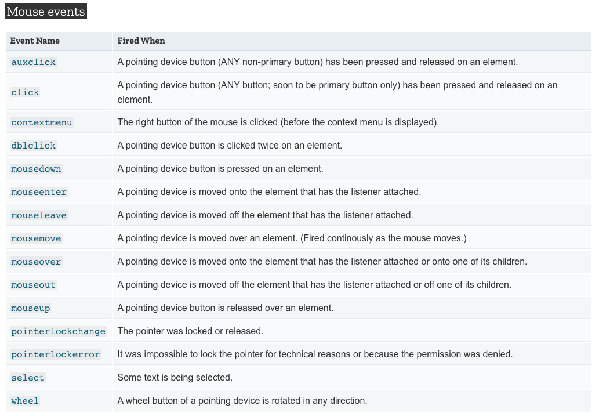

#### EventTarget Methods


###### addEventListner

The EventTarget method `addEventListener()` sets up a function that will be called whenever the specified event is delivered to the target. 

Common targets are Element, Document, and Window, but the target may be any object that supports events (such as XMLHttpRequest).

`addEventListener()` works by adding a function or an object that implements EventListener to the list of event listeners for the specified event type on the EventTarget on which it's called.


```javascript
target.addEventListener(type, listener);
target.addEventListener(type, listener, options);
target.addEventListener(type, listener, useCapture);
target.addEventListener(type, listener, useCapture, wantsUntrusted); // wantsUntrusted is Firefox only
```

## Table Methods

https://www.w3schools.com/jsref/met_table_insertrow.asp


<a name="decorators"/>

## Decorators

Decorators use a special syntax in JavaScript, whereby they are prefixed with an `@` symbol and placed immediately before the code being decorated.


In its simplest form, a decorator is simply a way of wrapping one piece of code with another — literally “decorating” it. This is a concept you might well have heard of previously as functional composition, or higher-order functions.


```javascript
function doSomething(name) {
  console.log('Hello, ' + name);
}

function loggingDecorator(wrapped) {
  return function() {
    console.log('Starting');
    const result = wrapped.apply(this, arguments);
    console.log('Finished');
    return result;
  }
}

const wrapped = loggingDecorator(doSomething);
```

This example produces a new function — in the variable wrapped — that can be called exactly the same way as the doSomething function, and will do exactly the same thing. The difference is that it will do some logging before and after the wrapped function is called:

```javascript
doSomething('Graham');
// Hello, Graham

wrapped('Graham');
// Starting
// Hello, Graham
// Finished
```

#### Class Member Decorators

Property decorators are applied to a single member in a class — whether they are properties, methods, getters, or setters. This decorator function is called with three parameters:

- target: the class that the member is on.
- name: the name of the member in the class.
- descriptor: the member descriptor. This is essentially the object that would have been passed to Object.defineProperty.

```javascript
function readonly(target, name, descriptor) {
  descriptor.writable = false;
  return descriptor;
}

class Example {
  a() {}
  @readonly
  b() {}
}

const e = new Example();
e.a = 1;
e.b = 2;
// TypeError: Cannot assign to read only property 'b' of object '#<Example>'
```

<a name="async"/>

## Async


```javascript
function resolveAfter2Seconds(x) {
  return new Promise(resolve => {
    setTimeout(() => {
      resolve(x);
    }, 2000);
  });
}

async function f1() {
  var x = await resolveAfter2Seconds(10);
  console.log(x); // 10
}

f1();
```


<a name="callback-functions"/>

## Callback Functions


```javascript
function greeting(name) {
  alert('Hello ' + name);
}

function processUserInput(callback) {
  var name = prompt('Please enter your name.');
  callback(name);
}

processUserInput(greeting);
```

The above example is a synchronous callback, as it is executed immediately.

Note, however, that callbacks are often used to continue code execution after an `asynchronous` operation has completed — these are called asynchronous callbacks. A good example is the callback functions executed inside a `.then()` block chained onto the end of a promise after that promise fulfills or rejects. This structure is used in many modern web APIs, such as `fetch()`


<a name="example"/>

#### Example

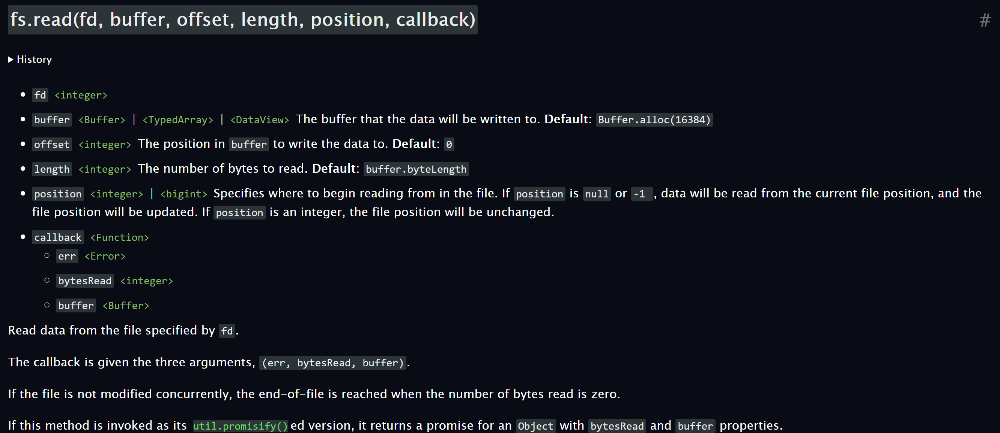

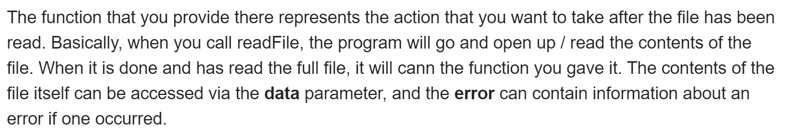


<a name="higher-order-functions"/>

## Higher Order Functions

E.g., `Map`, `filter`, and `reduce`


```javascript
isEven = (num) => num % 2 === 0;
result = [1, 2, 3, 4].filter(isEven);

console.log(result); // [2, 4]
```

```javascript
totalAge = users.reduce((total, user) => user.age + total, 0);

console.log(totalAge);
// 75
```

With functions in JavaScript, you can

- Store them as variables
- Use them in arrays
- Assign them as object properties (methods)
- Pass them as arguments
- Return them from other functions


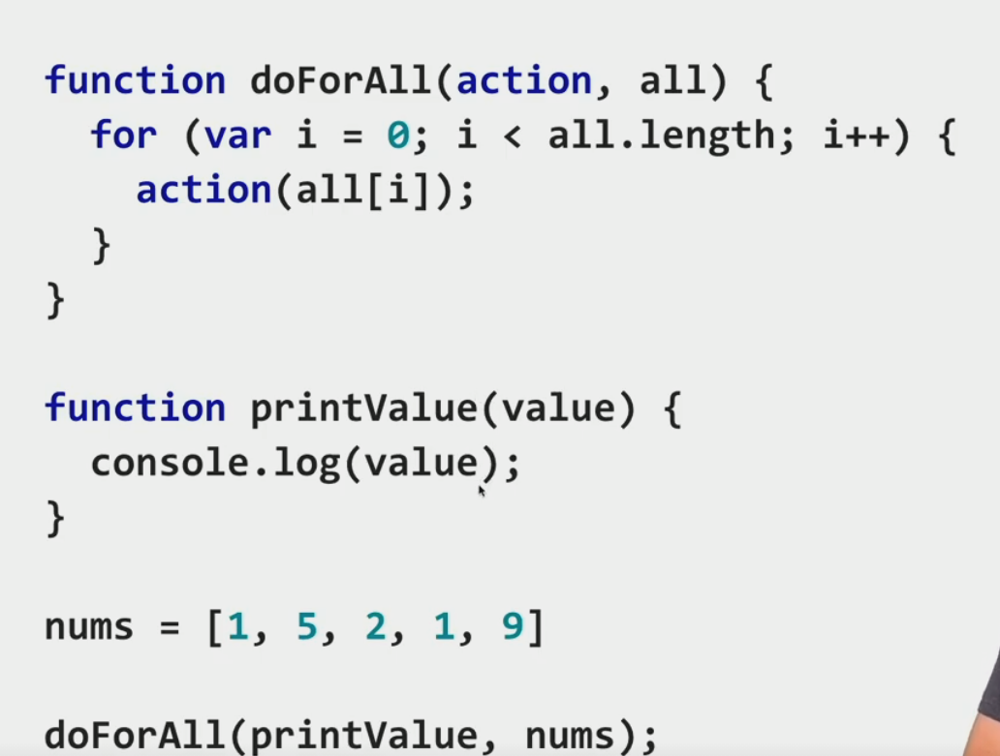

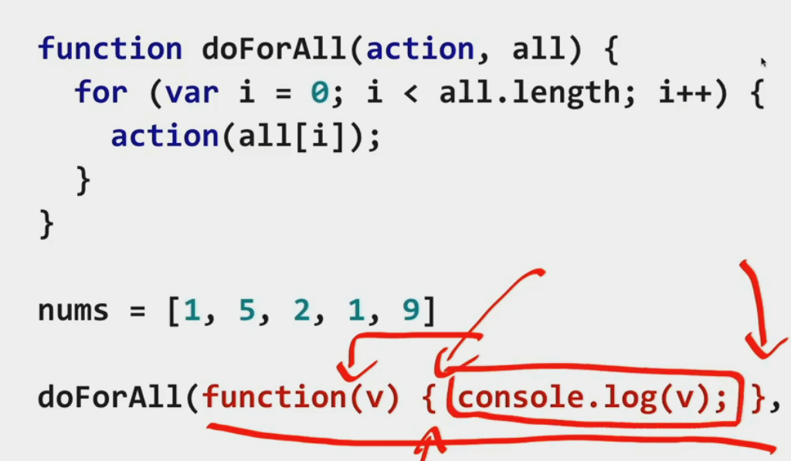

<a name="lambda-functions"/>

## Lambda Functions


An arrow function expression is a compact alternative to a traditional function expression, but is limited and can't be used in all situations.


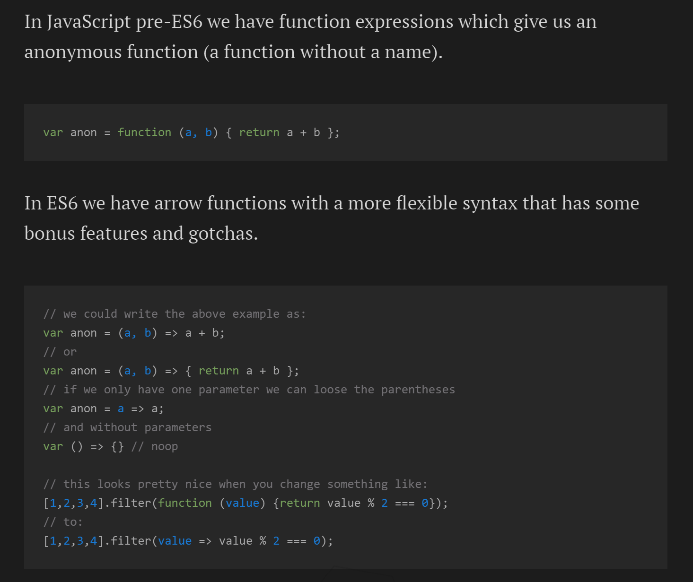

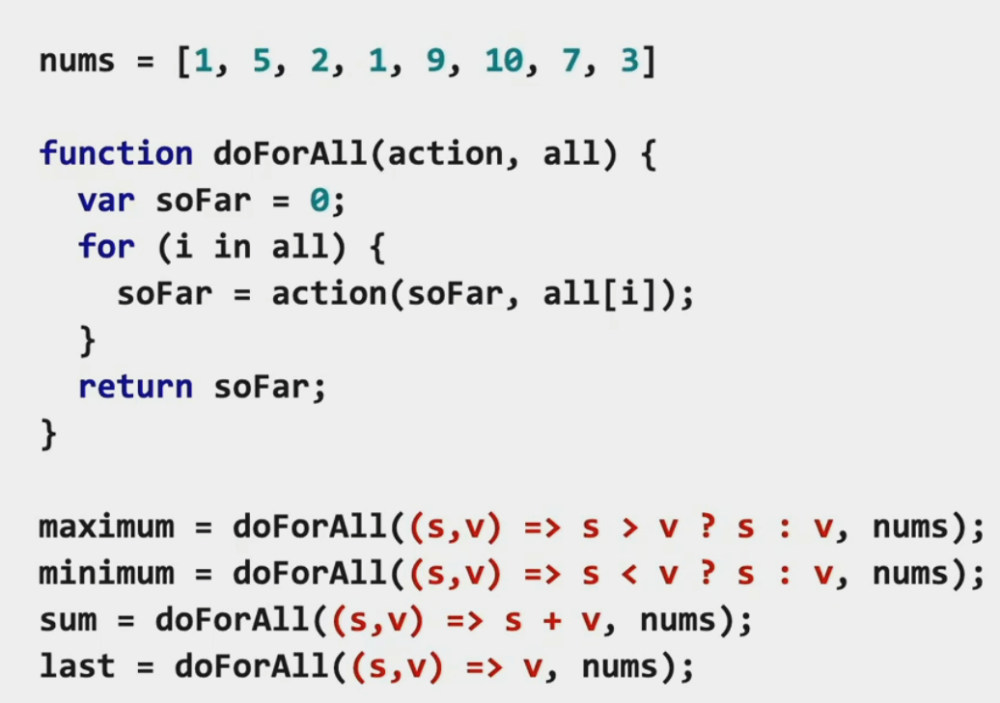

<a name="this"/>

#### `this`

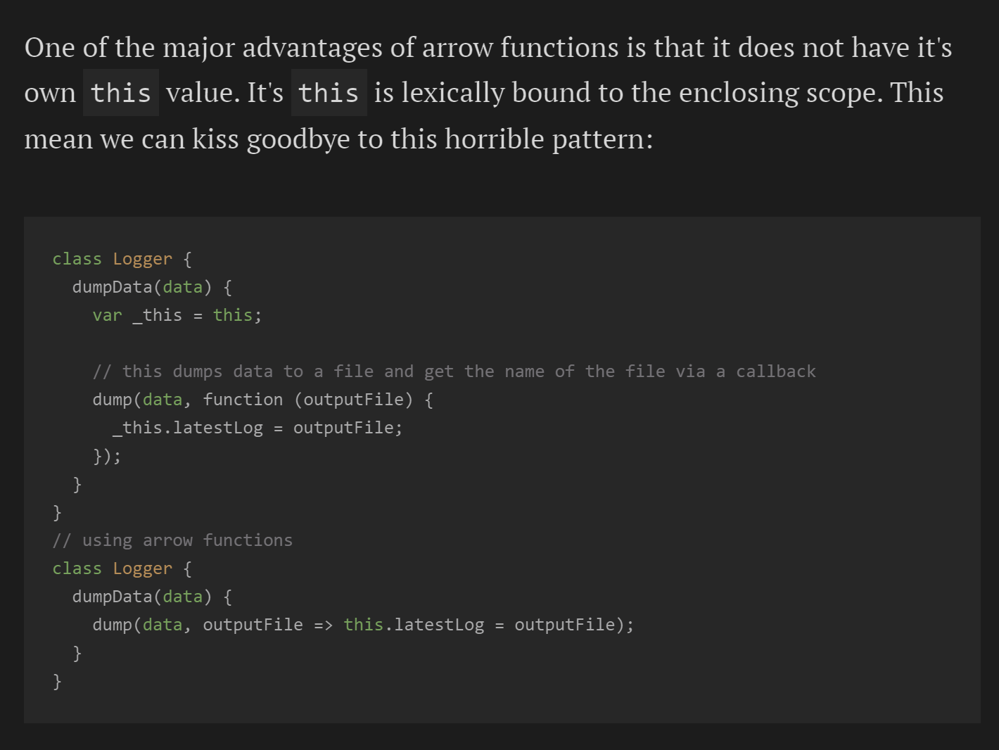

<a name="differences-&-limitations:"/>

#### Differences & Limitations

- Does not have its own bindings to `this` or `super`, and should not be used as methods.
- Does not have `arguments`, or `new.target` keywords.
- Not suitable for `call`, `apply` and `bind` methods, which generally rely on establishing a scope.
- Can not be used as constructors.
- Can not use `yield`, within its body.

<a name="example-breakdown"/>

#### Example Breakdown

```javascript
// Traditional Function
function (a){
  return a + 100;
}

// Arrow Function Break Down

// 1. Remove the word "function" and place arrow between the argument and opening body bracket
(a) => {
  return a + 100;
}

// 2. Remove the body brackets and word "return" -- the return is implied.
(a) => a + 100;

// 3. Remove the argument parentheses
a => a + 100;
```

<a name="variable-types"/>

## Variable Types

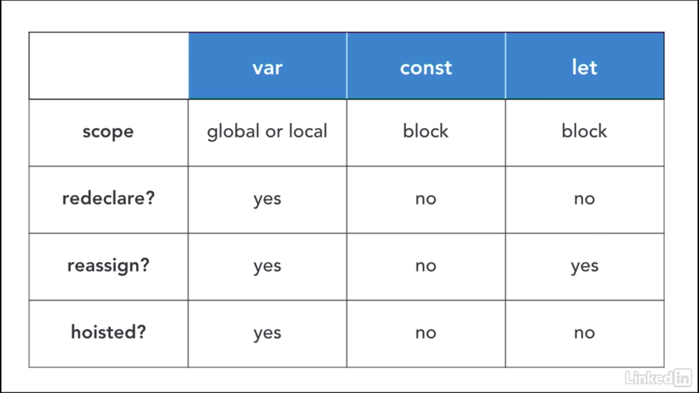


<a name="dom-overview"/>

## DOM Overview

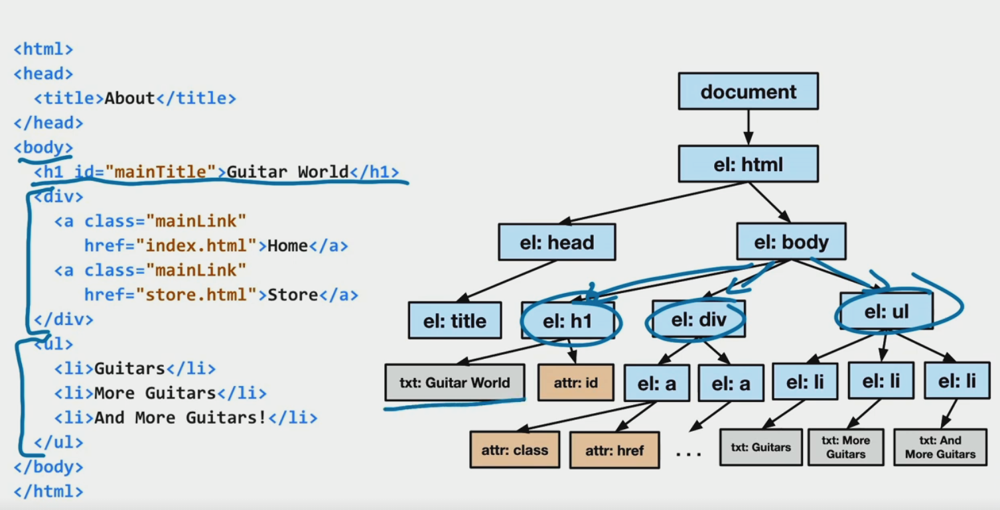

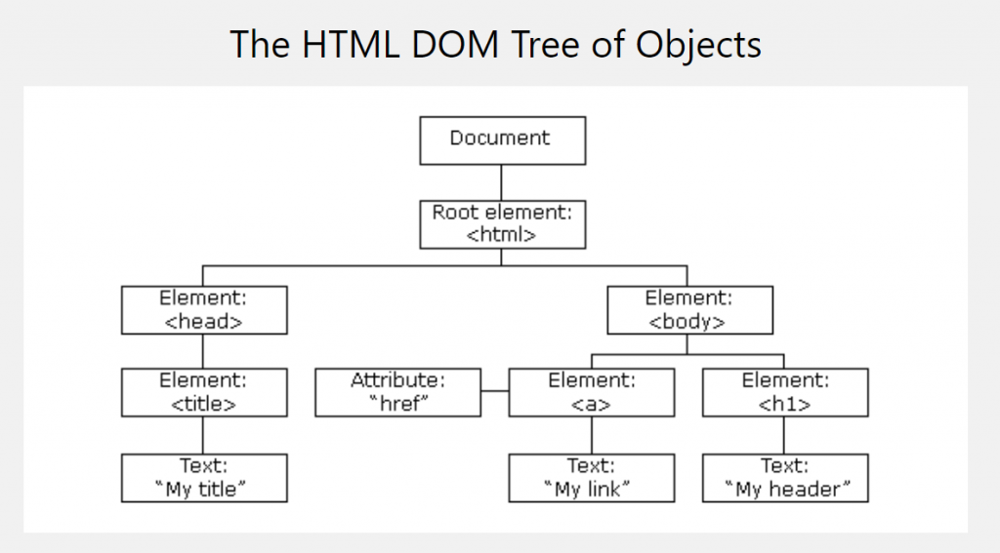

<a name="html-tag-components"/>

##### HTML Tag Components

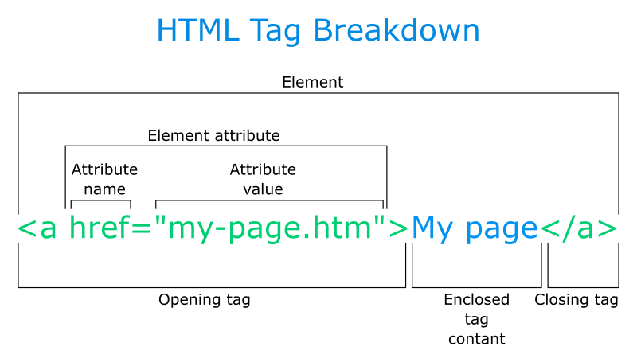


-----------------------------

<div align="center" style="font-size: 11px; margin: 0; opacity:.6"><a href="#table-of-contents">Top (目次)</a></div>

