# Types


<a name="table-of-contents"/>

###### Table of Contents

- [**ASYNC**](#async)
- [**CALLBACK FUNCTIONS**](#callback-functions)
  - [***Example***](#example)
- [**HIGHER ORDER FUNCTIONS**](#higher-order-functions)
- [**LAMBDA FUNCTIONS**](#lambda-functions)
  - [***`this`***](#this)
  - [***Differences & limitations:***](#differences-&-limitations)
  - [***Example breakdown***](#example-breakdown)
- [**VARIABLE TYPES**](#variable-types)
- [**DOM OVERVIEW**](#dom-overview)
  - [***Html tag components***](#html-tag-components)


<a name="reminders"/>

## Reminders

#### `forEach`

```javascript
// Arrow function
forEach((element) => { ... } )
forEach((element, index) => { ... } )
forEach((element, index, array) => { ... } )

// Callback function
forEach(callbackFn)
forEach(callbackFn, thisArg)

// Inline callback function
forEach(function callbackFn(element) { ... })
forEach(function callbackFn(element, index) { ... })
forEach(function callbackFn(element, index, array){ ... })
forEach(function callbackFn(element, index, array) { ... }, thisArg)
```

## Window Methods

#### `prompt`

Display a prompt box which ask the user for her/his name, and output a message:

```javascript
var person = prompt("Please enter your name", "Harry Potter");

if (person != null) {
  document.getElementById("demo").innerHTML =
  "Hello " + person + "! How are you today?";
}
```


## Array Methods

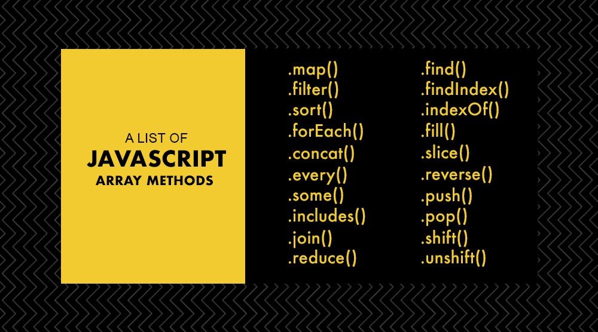


#### Array reduce

The reduce() method executes a reducer function (that you provide) on each element of the array, resulting in a single output value.

```javascript
const array1 = [1, 2, 3, 4];
const reducer = (accumulator, currentValue) => accumulator + currentValue;

// 1 + 2 + 3 + 4
console.log(array1.reduce(reducer));
// expected output: 10

// 5 + 1 + 2 + 3 + 4
console.log(array1.reduce(reducer, 5));
// expected output: 15
```

## Events

#### Event Types

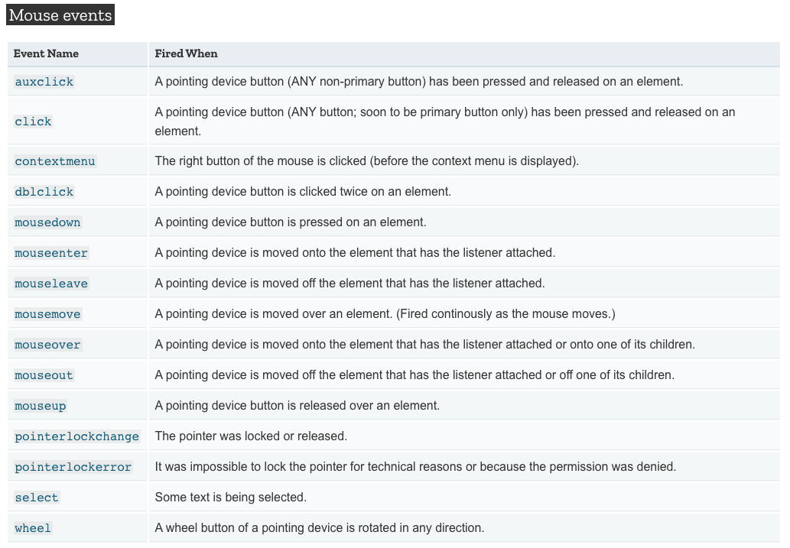

#### EventTarget Methods


###### addEventListner

The EventTarget method `addEventListener()` sets up a function that will be called whenever the specified event is delivered to the target. 

Common targets are Element, Document, and Window, but the target may be any object that supports events (such as XMLHttpRequest).

`addEventListener()` works by adding a function or an object that implements EventListener to the list of event listeners for the specified event type on the EventTarget on which it's called.


```javascript
target.addEventListener(type, listener);
target.addEventListener(type, listener, options);
target.addEventListener(type, listener, useCapture);
target.addEventListener(type, listener, useCapture, wantsUntrusted); // wantsUntrusted is Firefox only
```

## Table Methods

https://www.w3schools.com/jsref/met_table_insertrow.asp


<a name="decorators"/>

## Decorators

Decorators use a special syntax in JavaScript, whereby they are prefixed with an `@` symbol and placed immediately before the code being decorated.


In its simplest form, a decorator is simply a way of wrapping one piece of code with another — literally “decorating” it. This is a concept you might well have heard of previously as functional composition, or higher-order functions.


```javascript
function doSomething(name) {
  console.log('Hello, ' + name);
}

function loggingDecorator(wrapped) {
  return function() {
    console.log('Starting');
    const result = wrapped.apply(this, arguments);
    console.log('Finished');
    return result;
  }
}

const wrapped = loggingDecorator(doSomething);
```

This example produces a new function — in the variable wrapped — that can be called exactly the same way as the doSomething function, and will do exactly the same thing. The difference is that it will do some logging before and after the wrapped function is called:

```javascript
doSomething('Graham');
// Hello, Graham

wrapped('Graham');
// Starting
// Hello, Graham
// Finished
```

#### Class Member Decorators

Property decorators are applied to a single member in a class — whether they are properties, methods, getters, or setters. This decorator function is called with three parameters:

- target: the class that the member is on.
- name: the name of the member in the class.
- descriptor: the member descriptor. This is essentially the object that would have been passed to Object.defineProperty.

```javascript
function readonly(target, name, descriptor) {
  descriptor.writable = false;
  return descriptor;
}

class Example {
  a() {}
  @readonly
  b() {}
}

const e = new Example();
e.a = 1;
e.b = 2;
// TypeError: Cannot assign to read only property 'b' of object '#<Example>'
```

<a name="async"/>

## Async


```javascript
function resolveAfter2Seconds(x) {
  return new Promise(resolve => {
    setTimeout(() => {
      resolve(x);
    }, 2000);
  });
}

async function f1() {
  var x = await resolveAfter2Seconds(10);
  console.log(x); // 10
}

f1();
```


<a name="callback-functions"/>

## Callback Functions


```javascript
function greeting(name) {
  alert('Hello ' + name);
}

function processUserInput(callback) {
  var name = prompt('Please enter your name.');
  callback(name);
}

processUserInput(greeting);
```

The above example is a synchronous callback, as it is executed immediately.

Note, however, that callbacks are often used to continue code execution after an `asynchronous` operation has completed — these are called asynchronous callbacks. A good example is the callback functions executed inside a `.then()` block chained onto the end of a promise after that promise fulfills or rejects. This structure is used in many modern web APIs, such as `fetch()`


<a name="example"/>

#### Example

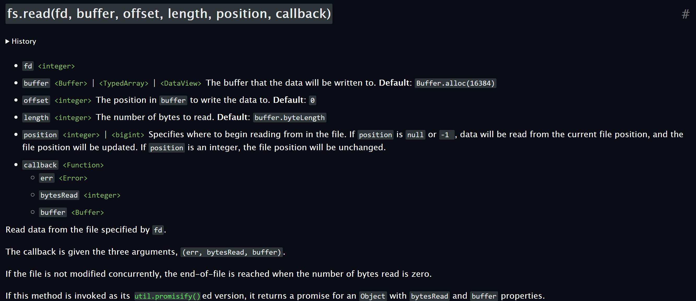

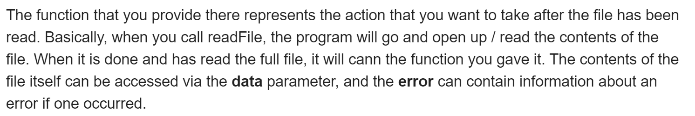


<a name="higher-order-functions"/>

## Higher Order Functions

E.g., `Map`, `filter`, and `reduce`


```javascript
isEven = (num) => num % 2 === 0;
result = [1, 2, 3, 4].filter(isEven);

console.log(result); // [2, 4]
```

```javascript
totalAge = users.reduce((total, user) => user.age + total, 0);

console.log(totalAge);
// 75
```

With functions in JavaScript, you can

- Store them as variables
- Use them in arrays
- Assign them as object properties (methods)
- Pass them as arguments
- Return them from other functions


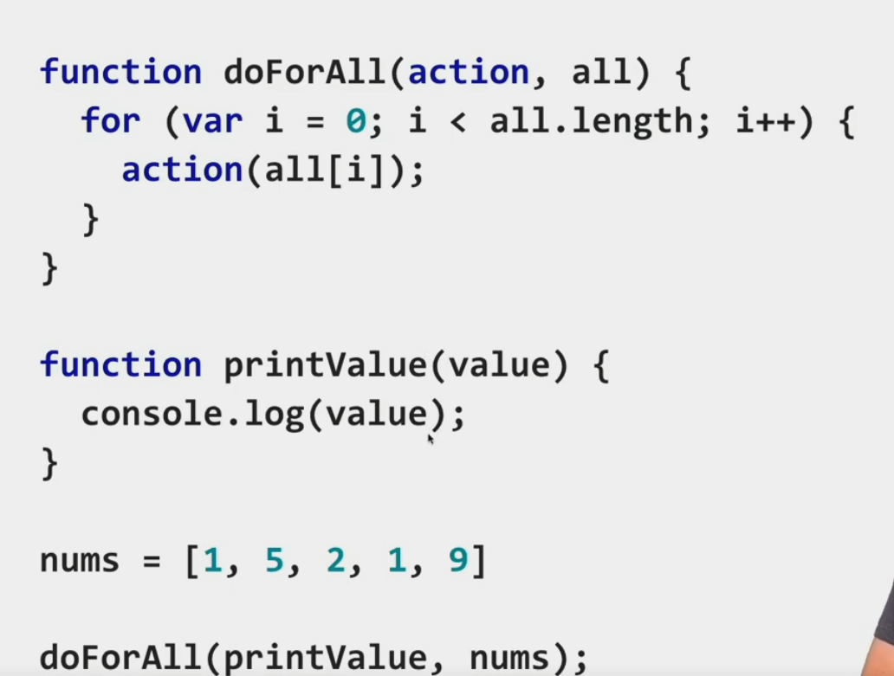

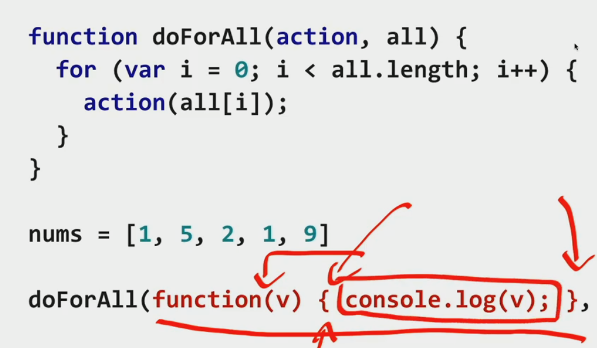

<a name="lambda-functions"/>

## Lambda Functions


An arrow function expression is a compact alternative to a traditional function expression, but is limited and can't be used in all situations.


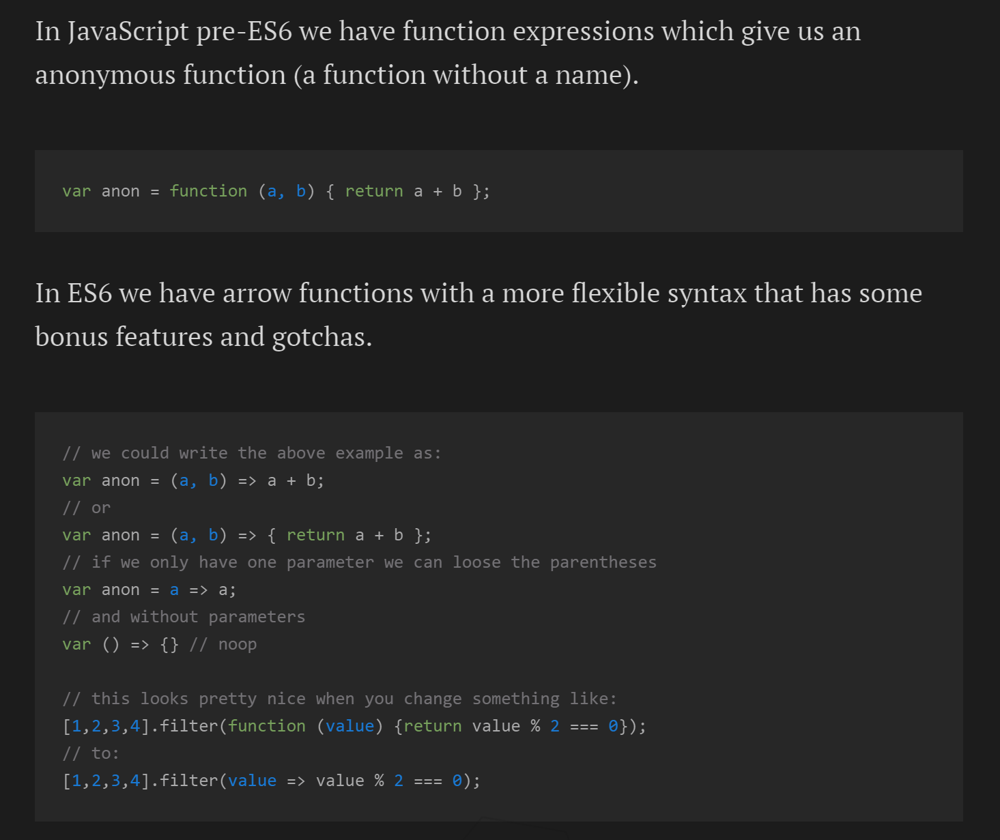

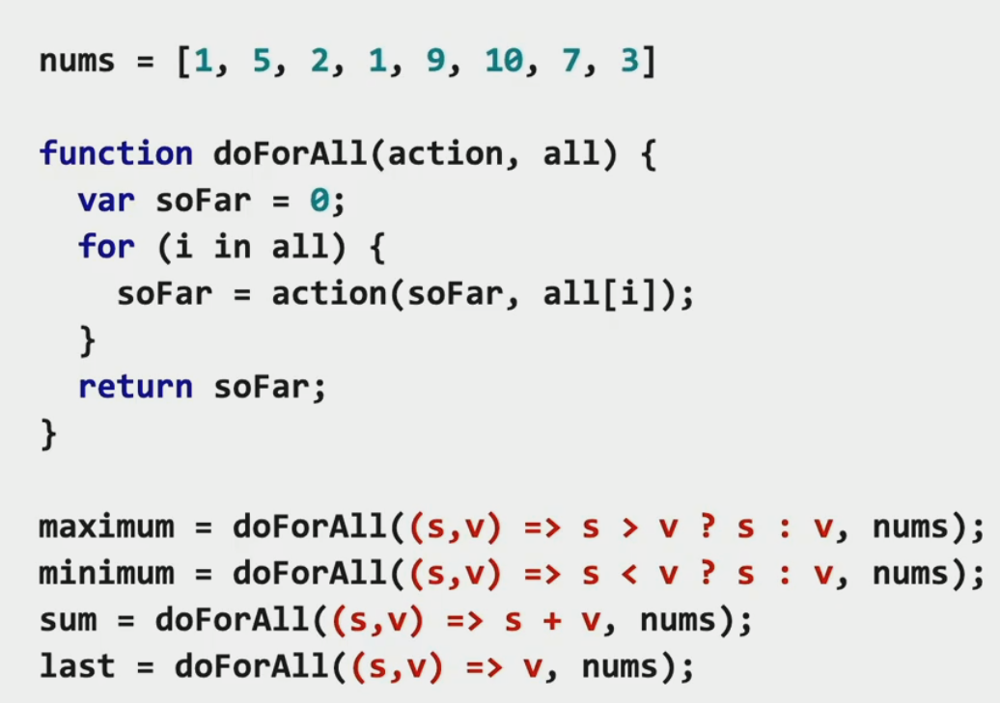

<a name="this"/>

#### `this`

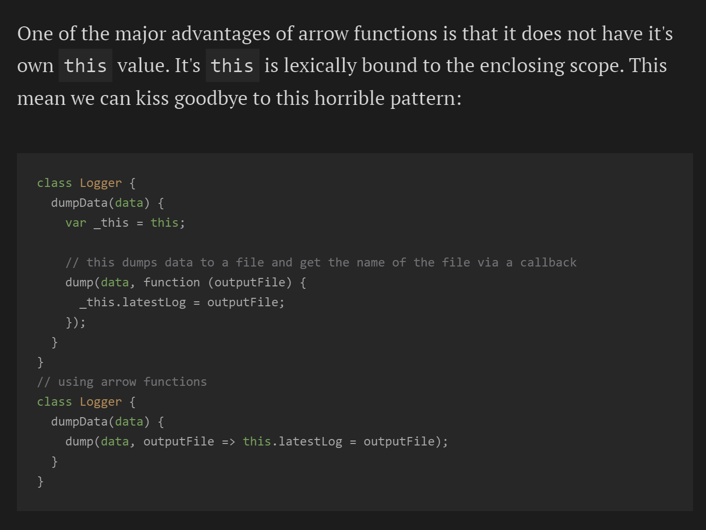

<a name="differences-&-limitations:"/>

#### Differences & Limitations

- Does not have its own bindings to `this` or `super`, and should not be used as methods.
- Does not have `arguments`, or `new.target` keywords.
- Not suitable for `call`, `apply` and `bind` methods, which generally rely on establishing a scope.
- Can not be used as constructors.
- Can not use `yield`, within its body.

<a name="example-breakdown"/>

#### Example Breakdown

```javascript
// Traditional Function
function (a){
  return a + 100;
}

// Arrow Function Break Down

// 1. Remove the word "function" and place arrow between the argument and opening body bracket
(a) => {
  return a + 100;
}

// 2. Remove the body brackets and word "return" -- the return is implied.
(a) => a + 100;

// 3. Remove the argument parentheses
a => a + 100;
```

<a name="variable-types"/>

## Variable Types

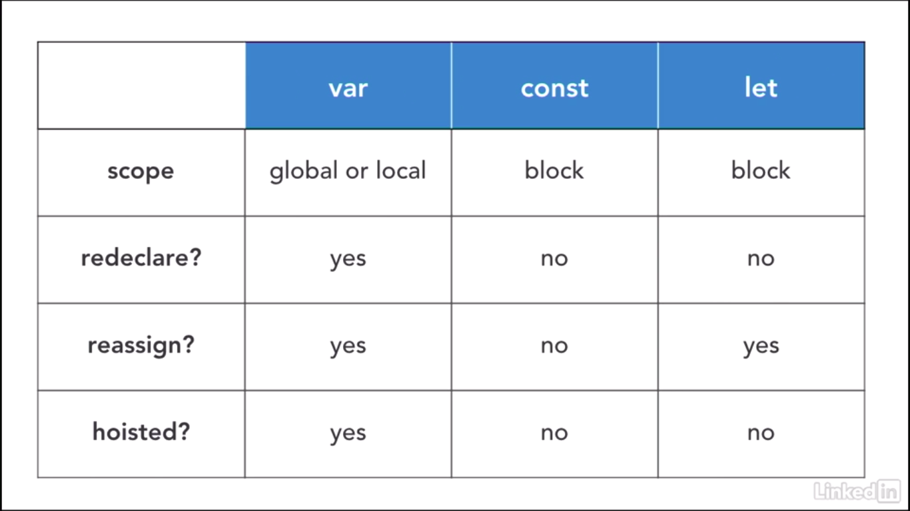


<a name="dom-overview"/>

## DOM Overview

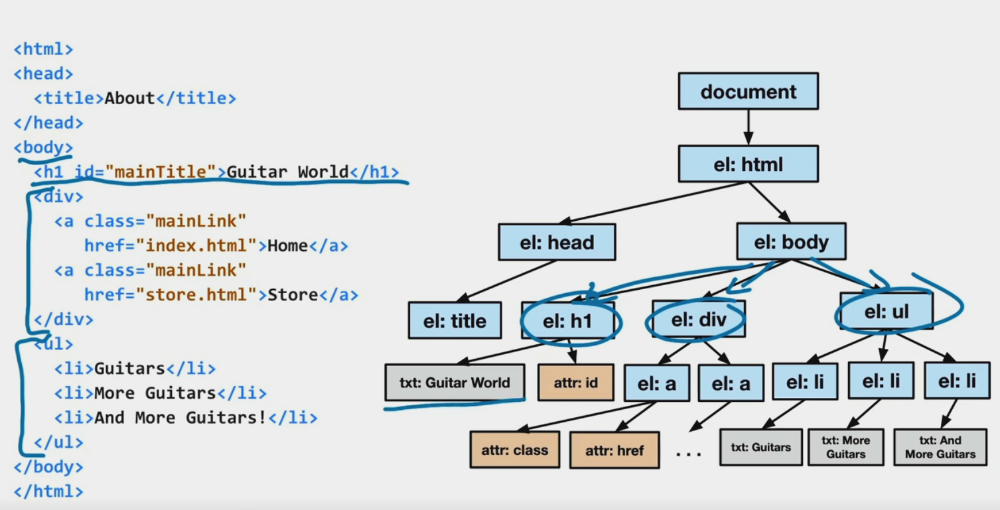


<a name="html-tag-components"/>

##### HTML Tag Components

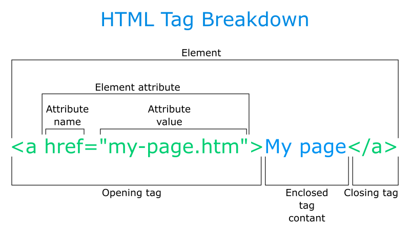


-----------------------------

<div align="center" style="font-size: 11px; margin: 0; opacity:.6"><a href="#table-of-contents">Top (目次)</a></div>

