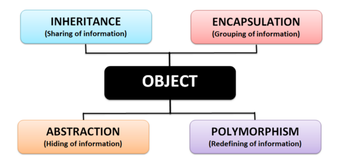
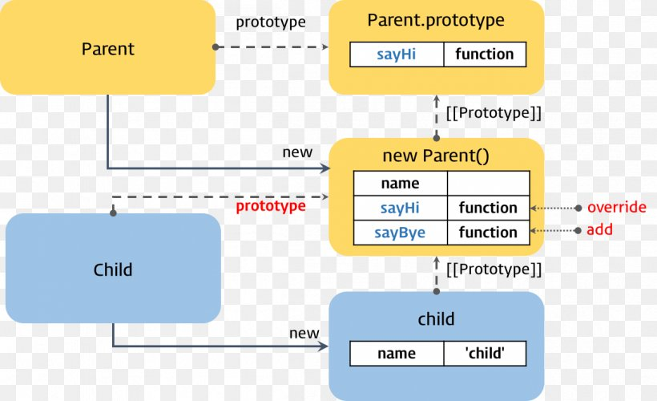

# 4 Pillars of OOP

### Objects

A group of related variables and methods are grouped into a unit = an object

 - The object’s variables = its properties
 - The object’s functions = its methods

Whenever you create something in Python, you are creating an object that is an instance of a specific class (String, function, integer, etc.)

- The class will determine how the object interacts with other objects
- The addition method is not defined for objects of int with objects of str-

### Encapsulation

Grouping related variables and functions that operate on them into sections = Encapsulation
Model parameters of a functin as properties of a function » when you call the function there is not a long list of params 
The fewer the parameters, the easier it is to use and maintain a function
 

### Abstraction

Simplifying the methods and properties of an object 
- Show only the essentials
- Simpler interface
- Reduce the impact of change
  - If you change the internal functinos of an object, it will not affect the program as a whole the internal functions do not leak outside of their object 
  - Deleting or redefining objects does not affet the project as a whole

### Inheritance

Objects can inherit properties and methods from other objects to eliminate redundancy 

### Polymorphism

Refactor ugly switch/case statemetns
A method can perform different tasks depending on what it is being applied to 

