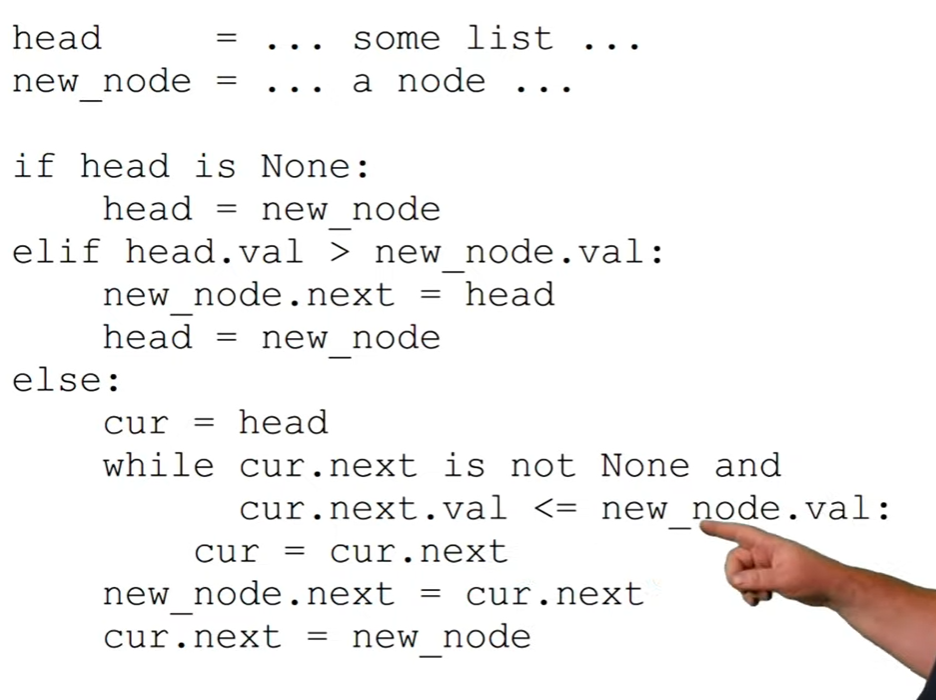
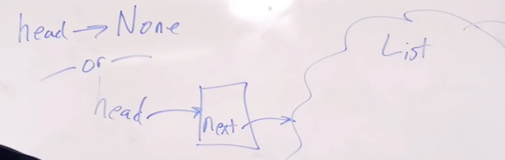
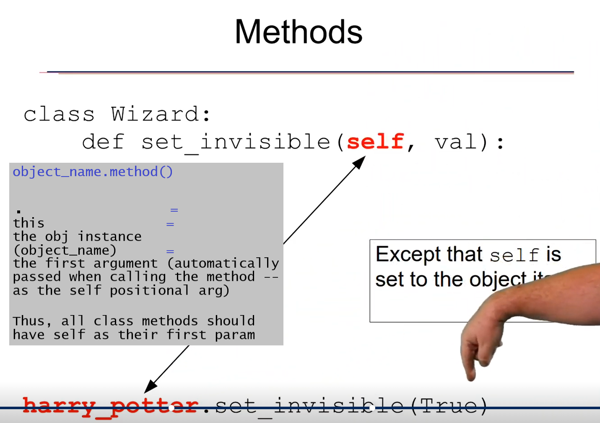

Write as separate text files and save
as 1.txt, 2.txt, 3.txt, . . .

```bash
lowriter --convert-to pdf [1-5].txt

rm [1-5].txt

pdfunite *.pdf $NAME.pdf

rm [1-5].pdf

xdg-open $NAME.pdf
```

# Notes

### Linked Lists

###### Iteration

Link List Iteration




###### Recursion 
head is the first node, but it also, in an abstract sense, points to the entire list (a linked list is represented by a reference to the head node). It follows that at any node in the list, the next property (in an abstract sense) points the entire remaining list.

Recursive Defintion of Linked Lists:




### Objects / Classes

###### Methods
 
dot notation




