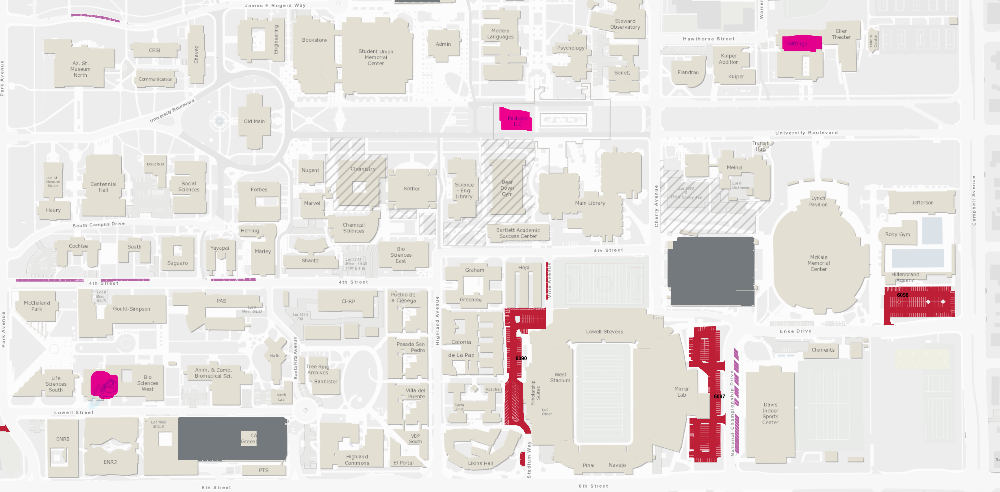

# Fall 2021

**Start/End Date**: 08/23/2021 - 12/08/2021

<a name="semester-schedule"/>

## Semester Schedule

<a name="schedule"/>

#### Schedule Overview

| Class | Code | Days | Times | Room | Instructor | Units |
|-------|------|-------|-----:|------------|------|:-----:|
| Software Development | 210 | MoWeFr | 9-9:50 | Gittings Bldg, Rm 129B Online | D. Claveau | 4 |
| Calculus 2           | 129 | MoWeFr | 1-1:50 | Biol Sci West, Rm 208 | B. Cais  | 3 |
| Cloud Computing      | 346 | MoWeFr | 2-2:50 | M Pacheco ILC, Rm 141 | R. Lewis | 3 |
| Discrete Math in CompSci | 243 | TBA | TBA | Online | M. Stone | 3

<a name="map"/>

#### Map

<a name="class-descriptions"/>

#### Class Descriptions

###### Software Development

An introduction to the development of large­ scale software. Topics include modularization, design patterns, documentation, unit testing, source code control, build systems, debuggers, and performance tuning; all of the tools necessary for developing software as opposed to writing small programs.

###### Cloud Computing

This course focuses on cloud programming, with an emphasis on using the cloud to solve Big Data problems. The course will not only look at how distributed systems, databases, networks, etc. are used to implement cloud computing platforms and cloud applications, but also the impact of the infinite scalability and pay-as-you-go on the platforms and applications.

###### Discrete Mathematics in Computer Science

Set theory, logic, discrete structures; induction and recursion; graphs and networks; techniques of proof. Examinations are proctored.

###### Calculus II

Continuation of MATH 122B or MATH 125. Techniques of symbolic and numerical integration, applications of the definite integral to geometry, physics, economics, and probability; differential equations from a numerical, graphical, and algebraic point of view; modeling using differential equations, approximations by Taylor series. A graphing calculator is required for this course.  We recommend the TI-83 or TI-84 models. Calculators that perform symbolic manipulations, such as the TI-89, NSpire CAS, or HP50g, cannot be used. Examinations are proctored

------------------

<a name="prospective-classes"/>

## Prospective Classes

#### MATH  202 - 001   Introduction to Symbolic Logic

In Person

TuTh 9:30AM - 10:45AM	Social Sciences, Rm 222	Joseph Tolliver	08/23/2021 - 12/08/2021

#### MATH  223 - 001   Vector Calculus

MoTuWeTh 8:00AM - 8:50AM	Live Online	Qiu-Dong Wang	08/23/2021 - 12/08/2021

MoTuWeTh 9:00AM - 9:50AM
Instructor
Kevin Childers
Meeting Location
Education, Rm 318

MoTuWeTh 1:00PM - 1:50PM
Instructor
Staff
Meeting Location
Communication, Rm 311
Start and End Date
08/23/2021 - 12/08/2021

#### ISTA  311 - 001   Foundation of Information and Inference

An introduction to the mathematical theories of probability and information as tools for inference, decision-making, and efficient communication. Topics include discrete and continuous random variables, measures of information and uncertainty, discrete time/discrete state Markov chains, elements of Bayesian inference and decision-making, Bayesian and Maximum Likelihood parameter estimation, and elementary coding theory.

Enrollment Information:
(ISTA 116 or MATH 163 or MATH 263) and (ISTA 130 or CSC 110) or Consent of instructor.