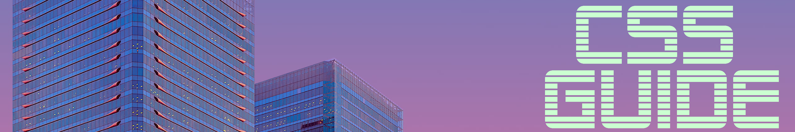

<a name="table-of-contents"/>




---

https://codemyui.com/tag/distortion-effect/

https://codepen.io/nikma/pen/PagzvV

### Variables

###### Preprocessor Variables

```css
$variable: red;

color: $variable;
```

###### Custom Properties

```css
--custom-color: red;

color: var(--custom-color);
```

###### Keywords

currentColor

```css
.link {
    border: 3px solid transparent;
    color: red;
}

.link:hover {
    border-color: currentColor;
}

/* currentColor is the default value of border-color */
```
*E.g., a button with an icon in it where you want the icon to match the text color*
